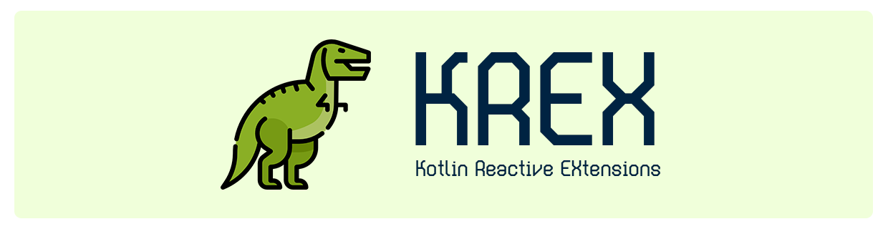

# KREX

<p align="center">



</p>

> 🌐 **Языки:**  
> [Русский](README.md) | [English](docs/README-EN.md)

## 🔎 Что такое KREX?

KREX (Kotlin Reactive EXtensions) - это Kotlin Multiplatform библиотека,
расширяющая стандартные возможности Coroutines и Kotlin Flow.

## 🌍 Поддерживаемые платформы

| Платформа | Статус              |
|-----------|---------------------|
| Windows   | ✅ Поддерживается    |
| Linux     | ❓ Неизвестно        |
| macOS     | ❓ Неизвестно        |
| Web       | ✅ Поддерживается    |
| Android   | ✅ Поддерживается    |
| iOS       | ❌ Не поддерживается |

Linux, macOS, iOS временно не поддерживаются, так как невозможно проверить
работоспособность библиотеки на данной платформе

## 🚀 Установка

**settings.gradle.kts**

```
dependencyResolutionManagement {
    repositoriesMode.set(RepositoriesMode.FAIL_ON_PROJECT_REPOS)
    repositories {
        ...
        maven ("https://jitpack.io")
    }
}
```

**build.gradle.kts**

```
dependencies {
      implementation("com.github.RavenZIP.krex:core:$version") 
}
```

Если вы используете libs.versions.toml

**libs.versions.toml**

```
[versions]
ravenzip-krex = "$version"

[libraries]
ravenzip-krex-core = { module = "com.github.RavenZIP.krex:core", version.ref = "ravenzip-krex" }
```

**build.gradle.kts**

```
dependencies {
      implementation(libs.ravenzip.krex.core)
}
```

## 🚬 Использование

Скоро...

## 📜 Лицензия

Эта библиотека распространяется по лицензии Apache 2.0. Подробности смотрите в файле [ЛИЦЕНЗИЯ](LICENSE).

## 👾 Разработчик

**Черных Александр**

- [Telegram](https://t.me/RavenZIP)
