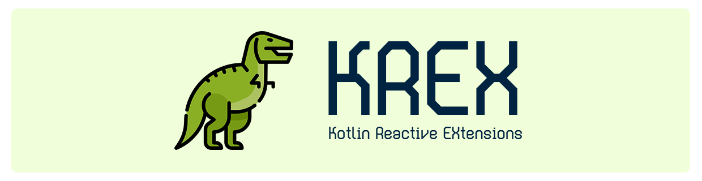

# KREX

<p align="center">



<a href="https://jitpack.io/#RavenZIP/krex">
  
</a>
</p>

> 🌐 **Языки:**  
> [Русский](README.md) | [English](docs/README-EN.md)

## 🔎 Что такое KREX?

KREX (Kotlin Reactive EXtensions) - это Kotlin Multiplatform библиотека, которая предоставляет дополнительные операторы и утилиты для Kotlin Flow,
делая работу с реактивными потоками проще, безопаснее и выразительнее.

Библиотека не заменяет kotlinx.coroutines, а органично дополняет его, предоставляя недостающие операторы и утилиты, которые часто приходится писать самостоятельно.

## 🌍 Поддерживаемые платформы

| Платформа | Статус              |
|-----------|---------------------|
| Windows   | ✅ Поддерживается    |
| Linux     | ❓ Неизвестно        |
| macOS     | ❓ Неизвестно        |
| Web       | ✅ Поддерживается    |
| Android   | ✅ Поддерживается    |
| iOS       | ❌ Не поддерживается |

Linux, macOS, iOS временно не поддерживаются, так как невозможно проверить работоспособность библиотеки на данной платформе

## 🌳 Структура проекта

### - krex-core
Основной модуль библиотеки. Содержит Kotlin Flow операторы

### - docs
Документация проекта.

### - images
Изображения, используемые в README и документации.

## 🚀 Установка

**settings.gradle.kts**

```
dependencyResolutionManagement {
    repositoriesMode.set(RepositoriesMode.FAIL_ON_PROJECT_REPOS)
    repositories {
        ...
        maven ("https://jitpack.io")
    }
}
```

**build.gradle.kts**

```
dependencies {
      implementation("com.github.RavenZIP.krex:krex-core:$version") 
}
```

Если вы используете libs.versions.toml

**libs.versions.toml**

```
[versions]
ravenzip-krex = "$version"

[libraries]
ravenzip-krex-core = { module = "com.github.RavenZIP.krex:krex-core", version.ref = "ravenzip-krex" }
```

**build.gradle.kts**

```
dependencies {
      implementation(libs.ravenzip.krex.core)
}
```

## 🚬 Примеры

### Преобразование событий `Flow<T>` в уведомления типа `FlowNotification<T>`.

```kotlin
flow {
  emit(1)
  emit(2)
  throw IllegalStateException("Boom")
}.materialize()
.collect(::println)
```

Результат

```text
FlowNotification.Next(1)
FlowNotification.Next(2)

// Ошибка представлена как обычное уведомление,
// поэтому её можно обработать без завершения collect исключением.
FlowNotification.Error(IllegalStateException("Boom"))
Complete
```

Для восстановления можно использовать оператор dematerialize.

### Фильтрация `Flow` после преобразование через materialize

```kotlin
repository.loadUser()
    .materialize()
    .collect { notification ->
        when (notification) {
            is FlowNotification.Next -> {
                User = notification.value
            }

            is FlowNotification.Error -> {
                snackBarService.showError(notification.error)
            }

            else -> {
              // do nothing
            }
        }
    }
```
   
### Преобразование `Flow<T?>` в `Flow<T>`.

```kotlin
flowOf("Alice", null, "Bob")
    .throwIfNull { IllegalStateException("User is null") }
    .collect(::println)
```

Результат

```text
Alice
IllegalStateException: User is null
```

В README приведены лишь несколько наиболее показательных примеров использования. Полный список операторов будет доступен в отдельной документации. До её появления ознакомиться с остальными возможностями можно, изучив исходный код библиотеки.

## 📚 Документация

В разработке...

## 📜 Лицензия

Эта библиотека распространяется по лицензии Apache 2.0. Подробности смотрите в файле [ЛИЦЕНЗИЯ](LICENSE).

## 👾 Разработчик

**Черных Александр**

- [Telegram](https://t.me/RavenZIP)
